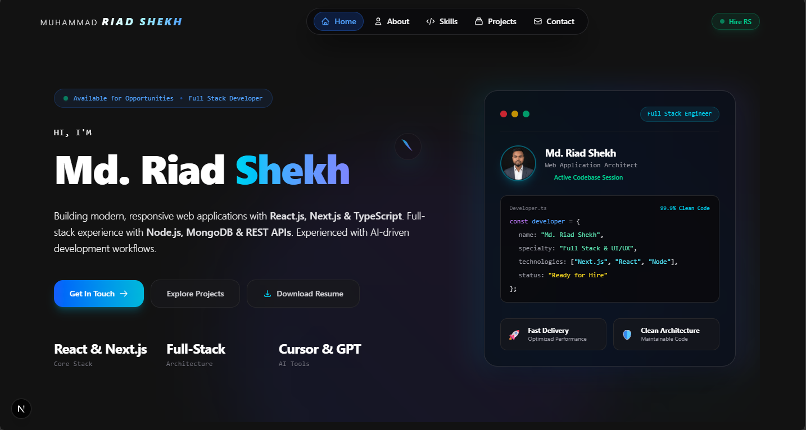

# Md. Riad Shekh — Frontend & Full Stack Web Developer


A polished, modern portfolio built with Next.js, React 19, TypeScript, Tailwind CSS v4, and Framer Motion. This repository is the source for a responsive personal website that highlights UI/UX craftsmanship, motion-rich interactions, live GitHub project data, and a working contact workflow.

## What this repo includes

- **Next.js App Router** with server and client components
- **React 19.2.4** and **TypeScript** for strong typed UI development
- **Tailwind CSS v4** plus glassmorphism, gradient-rich dark theme, responsive layout, and hover micro-interactions
- **Framer Motion** for animated entrance effects, scroll motion, and card transitions
- **@heroui/react / @heroui/styles** for modern component styling
- **Custom cursor overlay** with hover states, magnetic card attraction, and click ripple feedback
- **Animated splash screen** with timed fade-out
- **Scroll-driven canvas frame animation** with progressive image preloading
- **Live GitHub project viewer** that fetches repositories, parses README content, and filters by categories
- **Contact page with form backend** using Nodemailer and Gmail credentials
- **About page** with background video, career highlights, and polished profile presentation
- **Skills page** with animated clusters, hexagon visuals, and interactive skill cards

## Repo structure highlights

- `app/page.tsx` — homepage hero, feature cards, project preview, skills overview, and contact CTA
- `app/layout.tsx` — global layout, custom fonts, splash screen, and custom cursor mount
- `app/components/CustomCursor.tsx` — premium pointer experience with glass ring, pointer animation, and hover behavior
- `app/components/FrameScrollAnimation.tsx` — image sequence canvas animation with smooth frame interpolation
- `app/components/GithubProjects.tsx` — GitHub API integration, repository parsing, searchable/filterable portfolio cards
- `app/api/contact/route.ts` — contact POST route using Gmail and Nodemailer
- `app/contact/ContactClient.tsx` — contact form UI with email, phone, WhatsApp, and social links
- `app/skill/SkillClient.tsx` — interactive skill visualization with cluster and progress ring animations
- `app/about/AboutClient.tsx` — profile story, UI/UX highlights, and professional workflow overview
- `app/components/SkillsOverview.tsx` — homepage technical expertise cards with animated ring progress

## UI / UX and animation details

- Dark glassmorphism design with blurred frosted panels and soft neon glow accents
- Responsive navigation with desktop pill menu and mobile bottom button bar
- Custom animated hero panel with profile photo, status badge, and code-style snippet card
- Polished homepage hero with clear CTA buttons, active availability indicator, and clean branding
- Smooth scroll entrance animations across sections and stat cards
- Video-backed layouts on About and Contact pages for immersive depth
- Live project cards powered by GitHub repository data and parsed README metadata
- Skill section using animated circular progress rings, marquees, and six core technology cards on the homepage

## Core technology stack

- React.js
- Next.js 16.2.12
- TypeScript
- JavaScript (ES6+)
- Tailwind CSS v4
- Framer Motion
- @heroui/react
- @heroui/styles
- Nodemailer
- GitHub API

## Development workflow reflected in the portfolio

- Frontend engineering with React, Next.js, TypeScript, Tailwind CSS, HeroUI, DaisyUI, and motion design
- Backend integration with Node.js, Express.js, REST APIs, and email handling
- AI-assisted development workflow references with ChatGPT, Claude, Cursor AI, and GitHub Copilot
- Deployment-ready architecture and responsive UI practices

## Environment setup

1. Install dependencies:

```bash
npm install
```

2. Run the development server:

```bash
npm run dev
```

3. Build for production:

```bash
npm run build
```

## Environment variables

- `GMAIL_APP_PASSWORD` — required for the contact API to send email via Gmail
- `GMAIL_USER` — optional Gmail sender email (defaults to `riadswebdev@gmail.com`)
- `NEXT_PUBLIC_GITHUB_TOKEN` — optional token to avoid GitHub API rate limits when fetching project repositories

## Contact

- **Email:** riadswebdev@gmail.com
- **Phone:** +8801314674108
- **GitHub:** https://github.com/riadswebdev
- **LinkedIn:** https://www.linkedin.com/in/riad-shekh
- **Portfolio:** https://github.com/riadswebdev/Portfolio

## About the author

Md. Riad Shekh is a frontend developer from Monipur, Gazipur, Bangladesh, building responsive, motion-driven web applications with a strong focus on modern UI, clean code, and practical full-stack workflows. This portfolio showcases the real code and UI concepts implemented in this repository.
